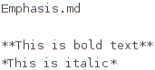
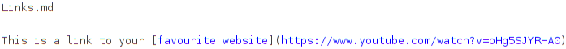
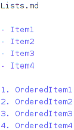

# Table of Content
1. [MarkdownIntro](#sid3115371428123433755)
2. [MbeddrDocumentation](#sid3115371428123433781)
3. [MarkdownExamples](#sid3115371428123433794)
	1. [Emphasis](#sid4007147449076626372)
	2. [Links](#sid4007147449076626860)
	3. [Lists](#sid4007147449076627511)
	4. [Html](#sid4007147449076627979)

4. [Clonclusion](#sid4007147449076628794)

# MarkdownIntro
Markdown is a widelly used markup language. It appeals to many people because of its readable syntax in its source form, portability and the adoption of it by many websites. Github as an example has already adopted markdwon support in all of its website, it can be used in commit messages, pull request descriptions or as the source for a Github page.

To take part of all of these advantages we have implemented a markdown language for mbeddr platform. This was developed with two major use cases in mind: As a generation target for your languages (it is not really intended for writting markdown documents inside MPS) and as the output format for your documents written with mbeddr documentation language (more on that in a second).

At the current moment this language supports all of the Markdown basic syntax ([https://www.markdownguide.org/basic-syntax/](https://www.markdownguide.org/basic-syntax/)) and for those cases where Markdown can't cover your needs you can always embed html code into your markdown document.
# MbeddrDocumentation
For a long time mbeddr platform comes with a documentation language that supports a close integration with MPS languages and models. Besides plain text, chapters, sections and other means to scructure your documents, it also allows referencing MPS nodes, or even embedding them into your document as images or text. Documents can be generated to HTML, Latex and now also Mardown.

By the way, it might not be noticeable, but this document itself was written with MPS documentation language and exported to Markdown :).
# MarkdownExamples
Here are some markdown examples from the mbeddr markdown language:
## Emphasis
You can emphasis your text with either bold or italic:

## Links

## Lists
Ordered and unordered lists:

## Html
Most applications allow using Html in Markdown documents:

# Clonclusion
If you are still unfamiliar with MPS, mbeddr and/or Markdown, here are some links to get you started:
- [https://github.com/mbeddr/mbeddr.core](https://github.com/mbeddr/mbeddr.core) for Mbeddr github page
- [https://www.markdownguide.org](https://www.markdownguide.org) for Markdown basics
- [https://www.jetbrains.com/mps/](https://www.jetbrains.com/mps/) MPS homepage

