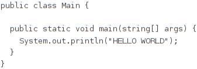

# Table of Content
1. [Intro](#sid4007147449076628794)
2. [Markdown](#sid3115371428123433755)
3. [Mbeddr](#sid3115371428123433781)
4. [Examples](#sid3115371428123433794)
	1. [Lists](#sid797083449154770914)
		1. [Unordered](#sid797083449154770926)
		2. [Ordered](#sid797083449154770968)

	2. [Styles](#sid797083449154771010)
	3. [Links](#sid797083449154782067)
	4. [Code](#sid797083449154782313)
	5. [ImageParagraph](#sid6367138909119273277)
	6. [ImageRef](#sid6367138909120086063)
	7. [SectionRef](#sid603951059623514998)
	8. [ModelContentReference](#sid603951059623810414)
	9. [FootNotes](#sid603951059622661712)

# Intro
With Markdown being widely adopted as a source form for many websites, we have decided to implement a markdown generator for mbeddr documentation language. This document is intended as an intro to the use cases for Markdown in MPS and more specifically for the mbeddr documentation language, for which we also include some examples.

If you are unfamiliar with Jetbrains MPS, mbeddr and/or Markdown, here are some links to get you started:
- [https://www.jetbrains.com/mps/](https://www.jetbrains.com/mps/) MPS homepage
- [https://www.markdownguide.org](https://www.markdownguide.org) for Markdown basics
- [https://github.com/mbeddr/mbeddr.core](https://github.com/mbeddr/mbeddr.core) for Mbeddr github page

# Markdown
Markdown is a widelly used markup language. It appeals to many people because of its readable syntax in its source form, portability and the adoption of it by many websites. Github as an example has already adopted markdwon support in all of its website, it can be used in commit messages, pull request descriptions or as the source for a Github page.

To take part of all of these advantages we have implemented a markdown language for mbeddr platform. This was developed with two major use cases in mind: As a generation target for your languages (it is not really intended for writting markdown documents inside MPS) and as the output format for your documents written with mbeddr documentation language (more on that in a second).

At the current moment this language supports all of the Markdown basic syntax ([https://www.markdownguide.org/basic-syntax/](https://www.markdownguide.org/basic-syntax/)) and for those cases where Markdown can't cover your needs you can always embed html code into your markdown document.
# Mbeddr
For a long time mbeddr platform comes with a documentation language that supports a close integration with MPS languages and models. Besides plain text, chapters, sections and other means to scructure your documents, it also allows referencing MPS nodes, or even embedding them into your document as images or text. Documents can be generated to HTML, Latex and now also Mardown.

By the way, it might not be noticeable, but this document itself was written with MPS documentation language and exported to Markdown :).
# Examples
This sections goal is to show some of the concepts available in the mbeddr documentation and how does its Markdown counterpart looks like.

## Lists
### Unordered
- Item 1
- Item 2
- Item 3

### Ordered
1. Ordered Item 1
2. Ordered Item 2
3. Ordered Item 3

## Styles
This is a regular text.

**This is bold text**

*This is italic text*

[ToDo: Todo text]
## Links
A link to your favourtie website [https://www.youtube.com/watch?v=oHg5SJYRHA0](https://www.youtube.com/watch?v=oHg5SJYRHA0)
## Code
Denote words and paragraphs like `this`
## ImageParagraph

## ImageRef
You can reference images like this [4.5-A](#sid6367138909119282925)
## SectionRef
Referencing a section also works like [Intro](#sid4007147449076628794)
## ModelContentReference
You can also reference a models content like this [Main](http://127.0.0.1:63320/node?ref=r%3A862b2bb8-dc71-4c58-92cc-da64971b150f%28MarkdownDemo.samples%29%2F2860495818774672153)
## FootNotes
We can also have foot notes like this 1.

---
1. Hi! I'm a footnote and I'm surprised you are reading me :)
